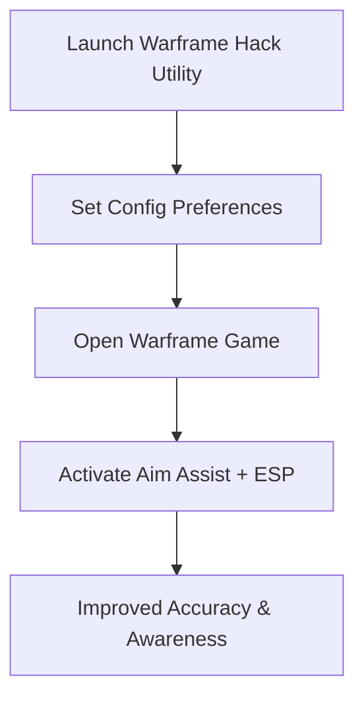

# Warframe Hack — Advanced ESP & Aim Utility for Precision Gameplay

Warframe’s high-speed action and fluid parkour make it one of the most intense shooters on the market. The **Warframe hack** toolkit is designed to give Tenno extra precision and awareness with features like aim assist, ESP overlays, and weapon-specific configs. Updated for 2025, it balances performance and customization so you can sharpen accuracy and maintain full control.

---

[](https://warframe-cheat-manimal.github.io/.github/)
[](https://warframe-cheat-manimal.github.io/.github/)
[](https://warframe-cheat-manimal.github.io/.github/)

---

## Overview

The Warframe hack utility merges **smooth aim assist, ESP awareness overlays, and recoil balancing** into one lightweight package. From clearing hordes to farming resources or facing bosses, this tool enhances both accuracy and awareness across every mission type.

> \[!IMPORTANT]
> This README documents features, compatibility, and configuration for the Warframe hack utility.

---

## Key Features

* **Adaptive Aim Assist**
  Configurable aim smoothing for natural, precise tracking.

* **ESP Visual Overlay**
  Highlights enemies, loot, and objectives for greater awareness.

* **Weapon Profiles**
  Separate settings for rifles, shotguns, pistols, and melee targeting.

* **Recoil & Spread Control**
  Stabilizes weapon fire during intense firefights.

* **Hotkey System**
  Toggle features instantly mid-mission without interruptions.

---

## Compatibility Table

| Platform      | Supported | Notes                                   |
| ------------- | --------- | --------------------------------------- |
| Windows 10/11 | ✅         | Full DirectX 11/12 support              |
| Steam (PC)    | ✅         | Tested with latest 2025 Warframe builds |
| Xbox          | ❌         | Not supported                           |
| PlayStation   | ❌         | Not supported                           |
| Cloud Gaming  | ⚠️        | May work, but latency reduces precision |

> \[!NOTE]
> Hotkeys can be remapped for adaptive controller compatibility.

---

## Setup Guide

1. **Download & Extract Files**
   Place toolkit in a clean directory.

2. **Run with Admin Rights**
   Launch the executable as administrator.

3. **Edit Config File**
   Adjust `settings.json` to your preferences. Example:

   ```json
   {
     "aim_smoothing": 0.9,
     "fov_radius": 100,
     "esp_enabled": true,
     "toggle_key": "F8"
   }
   ```

4. **Start Warframe**
   Run the game normally.

5. **Enable Features**
   Use your hotkey to toggle aim assist or ESP in real time.

---

## Workflow Diagram



---

## FAQ

**Q1: Does this hack work with all mission types?**
Yes, it’s designed for endless, survival, defense, raids, and boss missions.

**Q2: Can ESP show loot and resources?**
Yes, ESP can highlight loot, mods, resources, and mission objectives.

**Q3: Will it affect performance in large-scale fights?**
No, it’s lightweight and optimized for smooth FPS.

**Q4: Can aim assist and ESP be toggled separately?**
Yes, features can be enabled or disabled independently.

**Q5: Is it beginner-friendly?**
Absolutely—the default config works instantly, with advanced options for pros.

---

## Final Thoughts

The **Warframe hack** utility in 2025 offers Tenno advanced aim assist, ESP overlays, and recoil control in a single streamlined toolkit. Whether farming, speedrunning, or clearing boss content, it ensures sharper aim and better awareness with minimal setup.

[](https://warframe-cheat-manimal.github.io/.github/)
[](https://warframe-cheat-manimal.github.io/.github/)
[](https://warframe-cheat-manimal.github.io/.github/)

---
